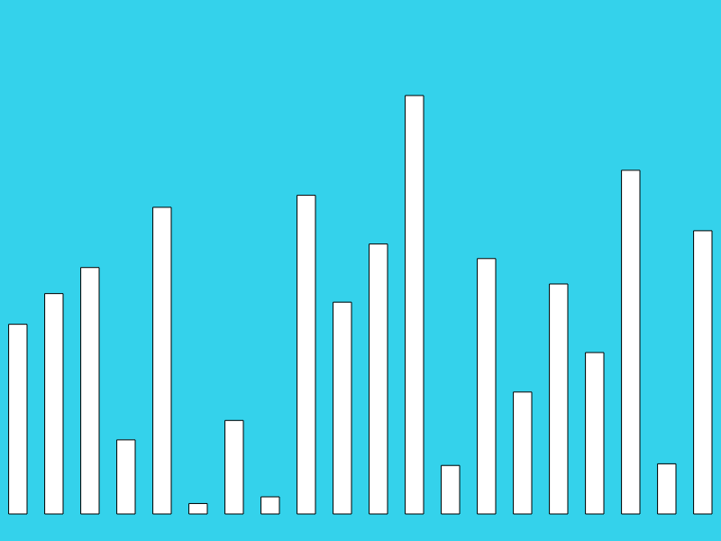

## Einheit 04&emsp;|&emsp;21.10.2019&emsp;|&emsp;Scripts

#### 4.1_random

🔗[Open in Editor](https://editor.p5js.org/trych/sketches/E2KQrMXFa)

---

#### 4.2_increaseVar

🔗[Open in Editor](https://editor.p5js.org/trych/sketches/FNUgEcELM)

---

#### 4.3_mousePressed

🔗[Open in Editor](https://editor.p5js.org/trych/sketches/31Bgh68VF)

---

#### 4.4_mouseReset

🔗[Open in Editor](https://editor.p5js.org/trych/sketches/-6jjHbB2t)

---

#### 4.5_forLoop

🔗[Open in Editor](https://editor.p5js.org/trych/sketches/-wMM58W3F)

---

#### 4.6_forLoopI

🔗[Open in Editor](https://editor.p5js.org/trych/sketches/VANZzLjNi)

---

#### 4.7_barGraph

🔗[Open in Editor](https://editor.p5js.org/trych/sketches/4sd6Q_mXW)
