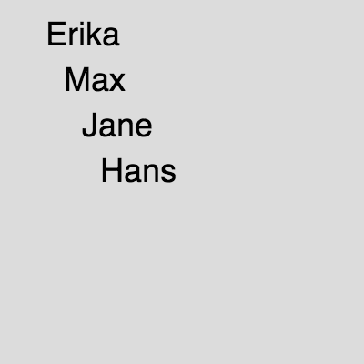

## Einheit 05&ensp;|&ensp;28.10.2019&ensp;|&ensp;Scripts

#### 5.1_if

🔗[Open in Editor](https://editor.p5js.org/trych/sketches/OlFBVOJCT)

---

#### 5.2_ifElse

🔗[Open in Editor](https://editor.p5js.org/trych/sketches/ScYNXnicW)

---

#### 5.3_circlesSquares

🔗[Open in Editor](https://editor.p5js.org/trych/sketches/dCPjSoCjj)

---

#### 5.4_pingPong

🔗[Open in Editor](https://editor.p5js.org/trych/sketches/24MkkEPNo)

---

#### 5.5_array

🔗[Open in Editor](https://editor.p5js.org/trych/sketches/Osj0-Fkbi)

---

#### 5.6_arrayLoop

🔗[Open in Editor](https://editor.p5js.org/trych/sketches/zi9mMnxLw)

---

#### 5.7_cats

🔗[Open in Editor](https://editor.p5js.org/trych/sketches/KGaf6CLjU)
