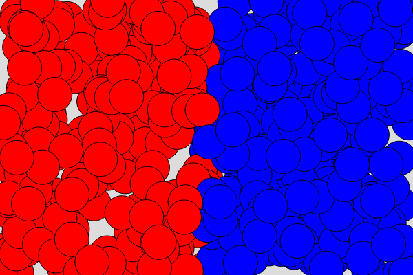
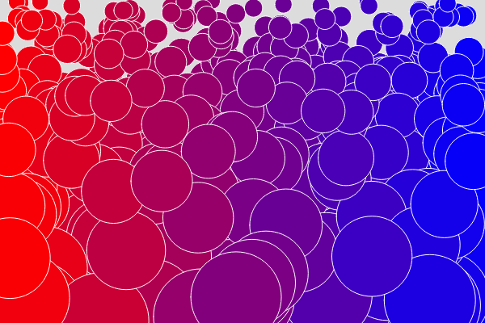
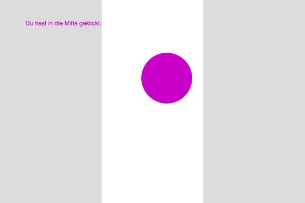
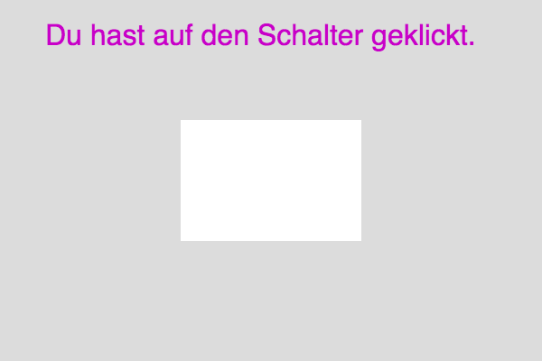

## Einheit 05&ensp;|&ensp;28.10.2019&ensp;|&ensp;Scripts

#### 7.1_ifElseColors

🔗[Open in Editor](https://editor.p5js.org/trych/sketches/54xnzUq2q)

---

#### 7.2_map

🔗[Open in Editor](https://editor.p5js.org/trych/sketches/VWZeZo_tY)

---

#### 7.3_ifAND

🔗[Open in Editor](https://editor.p5js.org/trych/sketches/KIQB5YtSC)

---

#### 7.4_multipleAND

🔗[Open in Editor](https://editor.p5js.org/trych/sketches/2fC6amGJg)

---

#### 7.5_boolean

🔗[Open in Editor](https://editor.p5js.org/trych/sketches/x98j3nHCT)

---

#### 7.6_image

🔗[Open in Editor](https://editor.p5js.org/trych/sketches/zhxXU5EzB)
