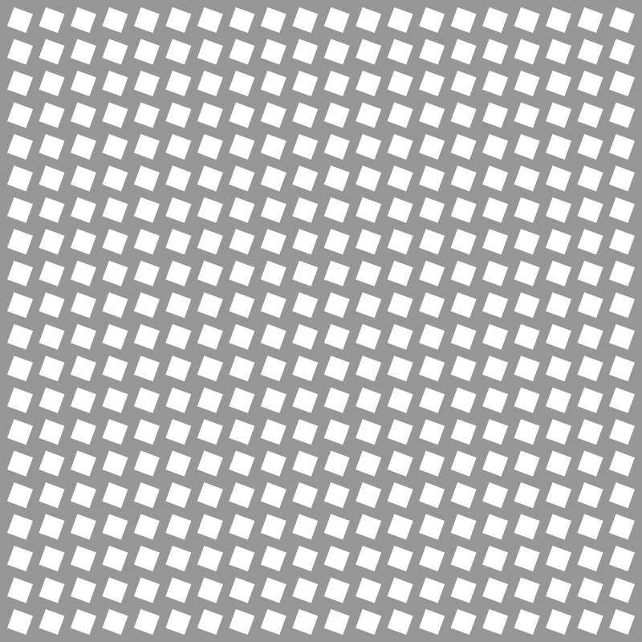

## Einheit 09&ensp;|&ensp;02.12.2019&ensp;|&ensp;Scripts

#### 9.1_rotateTranslate

🔗[Open in Editor](https://editor.p5js.org/trych/sketches/bYP9uvbAA)

---

#### 9.2_rotateTranslate_02

🔗[Open in Editor](https://editor.p5js.org/trych/sketches/4JxC0L3B3)

---

#### 9.3_grid

🔗[Open in Editor](https://editor.p5js.org/trych/sketches/1dzCrd6tM)

---

#### 9.4_gridRotated

🔗[Open in Editor](https://editor.p5js.org/trych/sketches/nC-sWW7L6)

---

#### 9.5_gridRotatedDistance

🔗[Open in Editor](https://editor.p5js.org/trych/sketches/mCuEHBKwS)

---

#### 9.6_image

🔗[Open in Editor](https://editor.p5js.org/trych/sketches/PjIStlJQ8)
