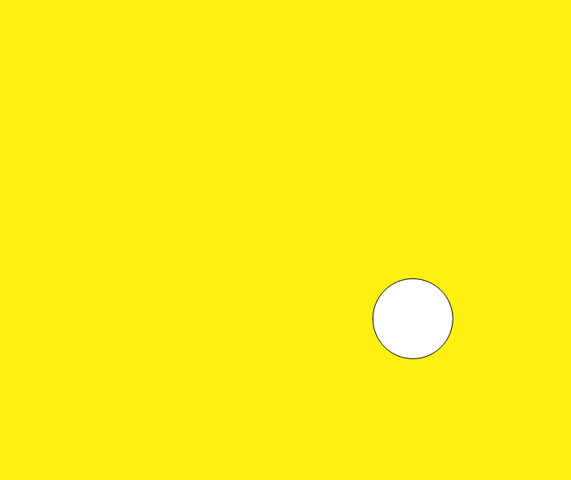
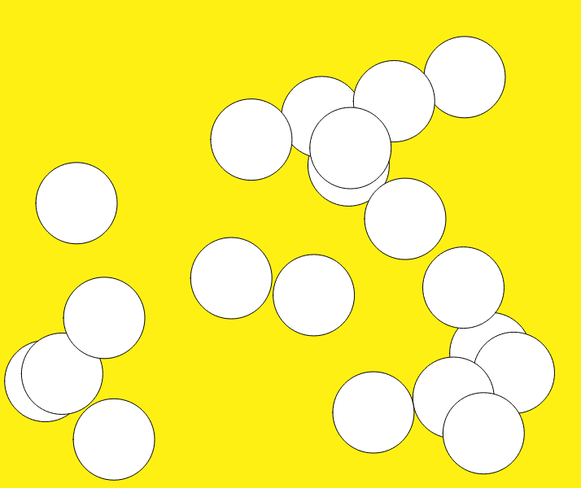
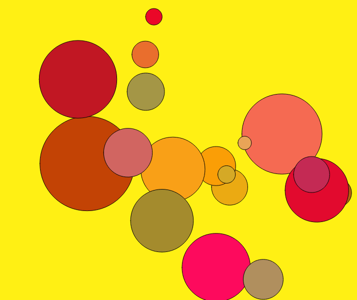
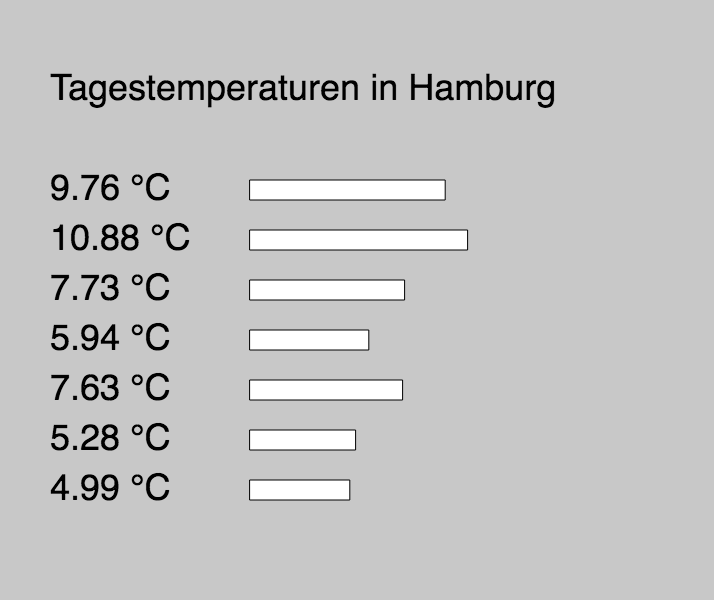

## Einheit 10&ensp;|&ensp;09.12.2019&ensp;|&ensp;Scripts

#### 10.1_object

🔗[Open in Editor](https://editor.p5js.org/trych/sketches/OXOFRuPoG)

---

#### 10.2_circleObject

🔗[Open in Editor](https://editor.p5js.org/trych/sketches/KDd2OnHi_)

---

#### 10.3_circleObjects

🔗[Open in Editor](https://editor.p5js.org/trych/sketches/sVYpbggOL)

---

#### 10.4_circleObjects_02

🔗[Open in Editor](https://editor.p5js.org/trych/sketches/uu6FnvCbT)

---

#### 10.5_api

🔗[Open in Editor](https://editor.p5js.org/trych/sketches/-lrycEt23)
