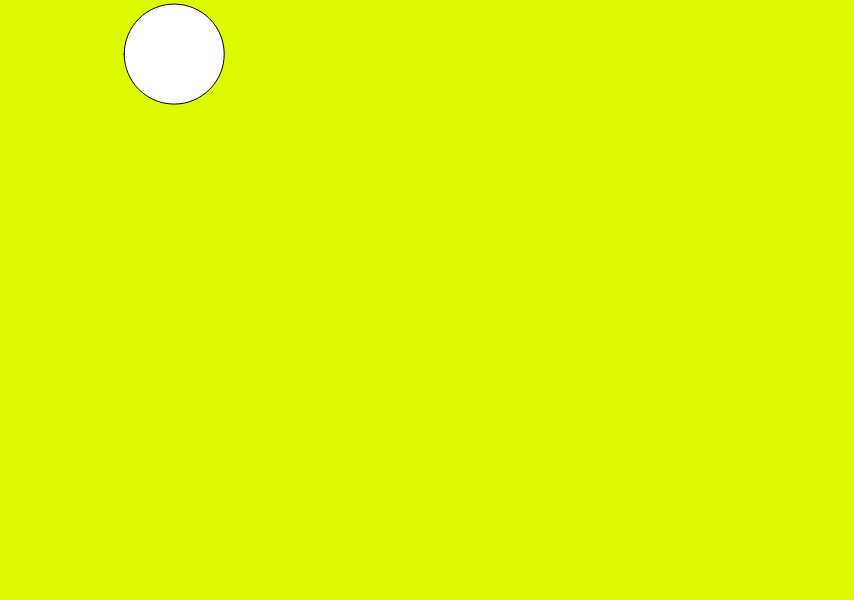
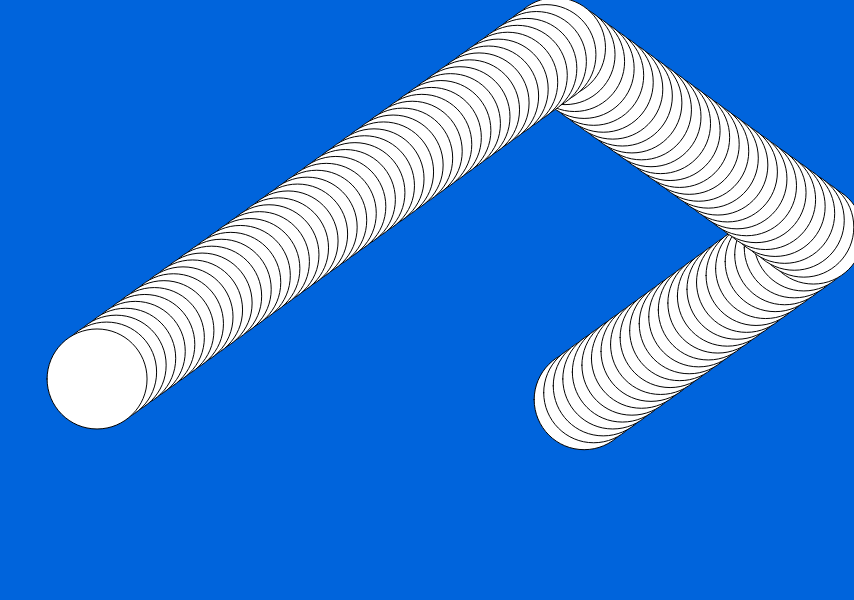

## Einheit 11&ensp;|&ensp;06.01.2020&ensp;|&ensp;Scripts

#### 12.1_bouncingCircle

🔗[Open in Editor](https://editor.p5js.org/trych/sketches/jxFavXB_t)

---

#### 12.2_arrayFunctions

🔗[Open in Editor](https://editor.p5js.org/trych/sketches/GPnZBXEar)

---

#### 12.3_movingCircleTrail

🔗[Open in Editor](https://editor.p5js.org/trych/sketches/54HXi69Cf)

---

#### 12.4_movingCircleTrailMapping

🔗[Open in Editor](https://editor.p5js.org/trych/sketches/_LhYqT22b)

---

#### 12.5_noise

🔗[Open in Editor](https://editor.p5js.org/trych/sketches/Wv36E6XoV)

---

#### 12.6_noiseTrail

🔗[Open in Editor](https://editor.p5js.org/trych/sketches/WlIGUakgr)
