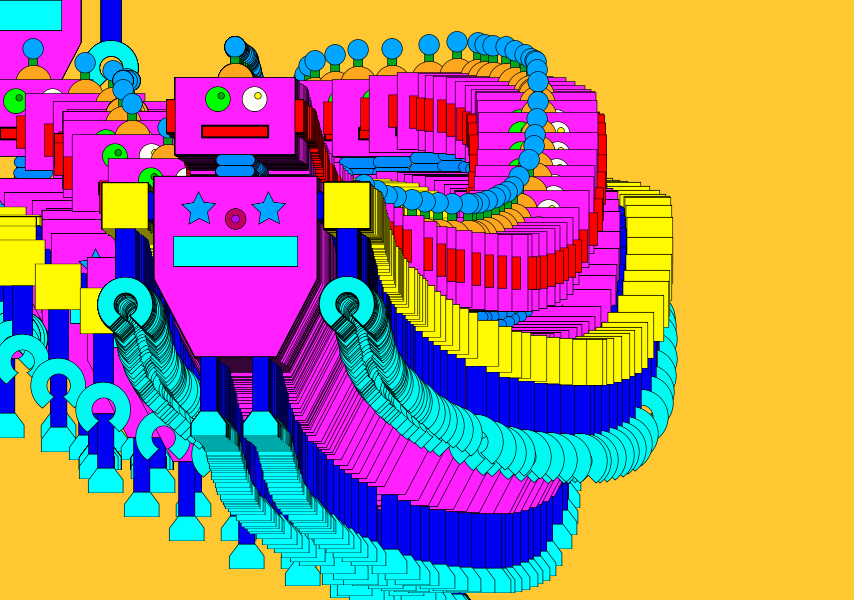
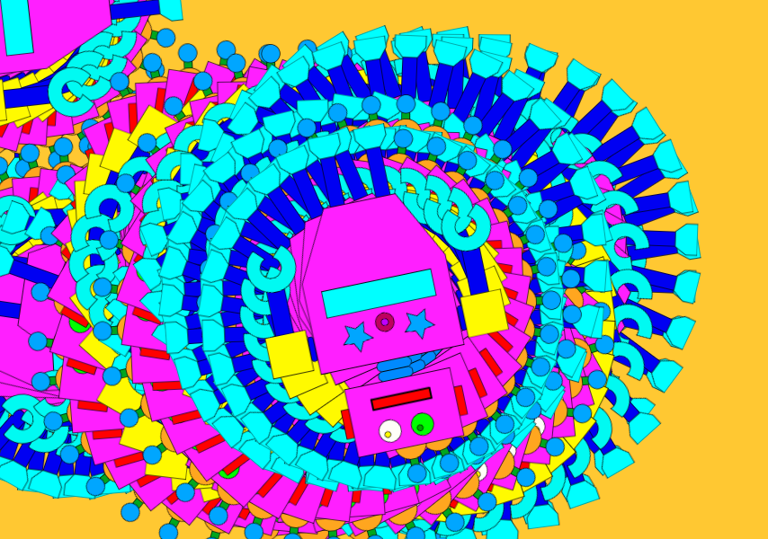
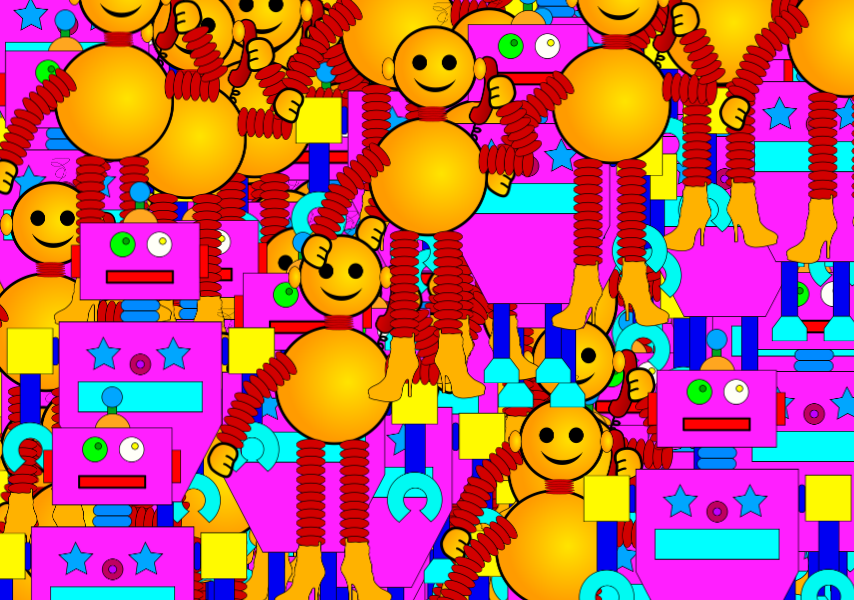
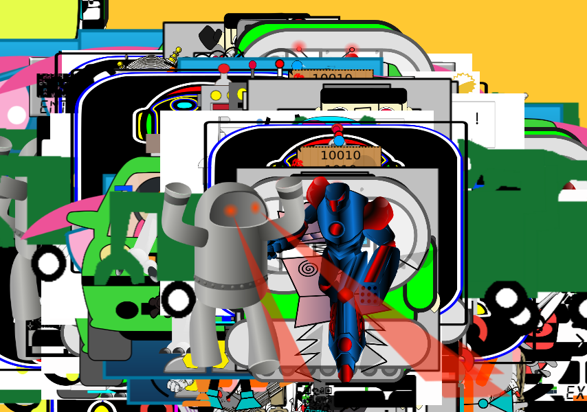
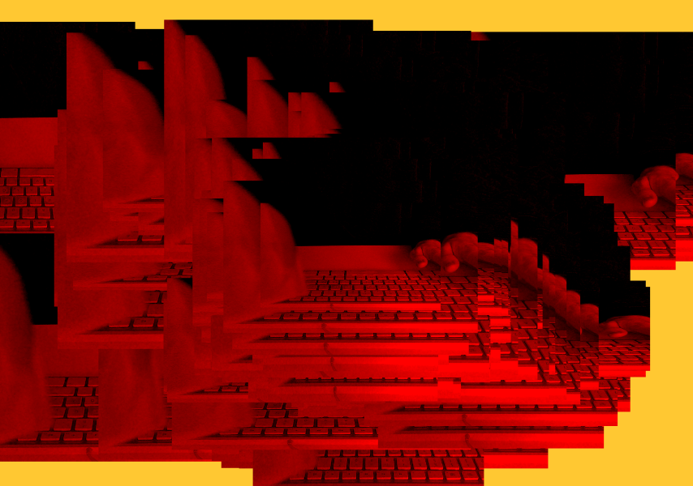
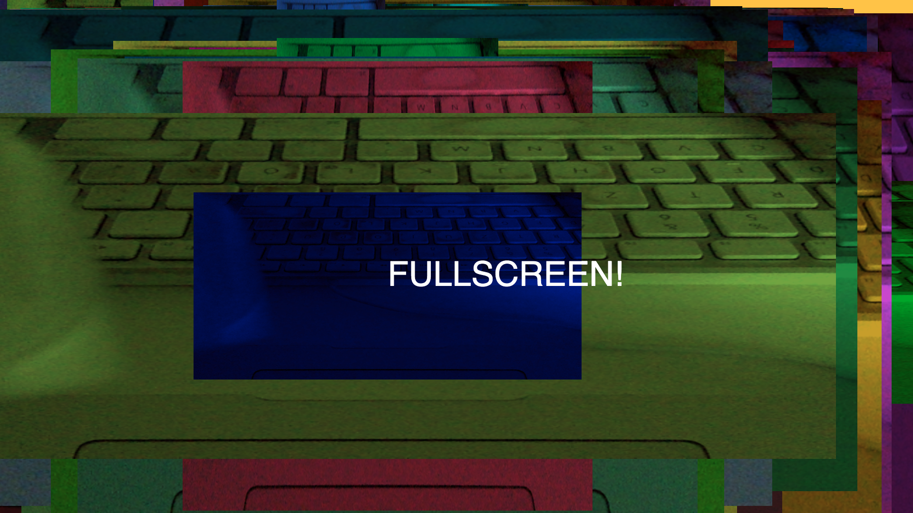
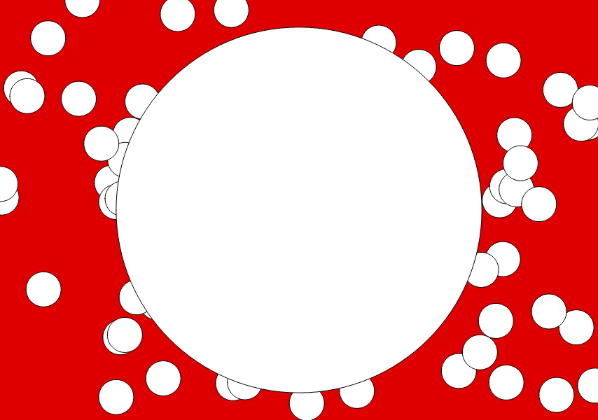
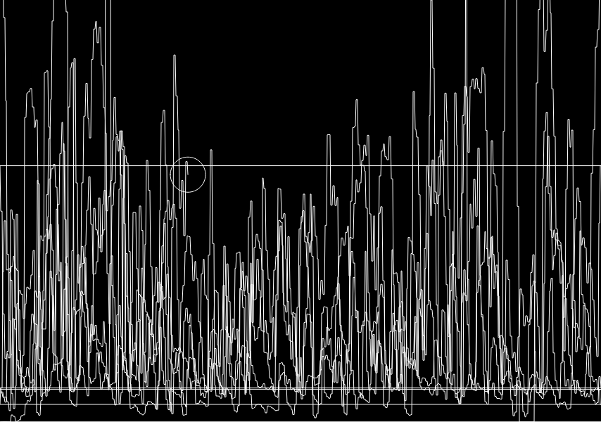

## Einheit 13&ensp;|&ensp;20.01.2020&ensp;|&ensp;Scripts

#### 13.1_img

🔗[Open in Editor](https://editor.p5js.org/trych/sketches/NEdJBkZRu)

---

#### 13.2_imgRotate

🔗[Open in Editor](https://editor.p5js.org/trych/sketches/hsQg7o4VJ)

---

#### 13.3_multiImg

🔗[Open in Editor](https://editor.p5js.org/trych/sketches/U1bDQ73bZ)

---

#### 13.4_multiImgArray

🔗[Open in Editor](https://editor.p5js.org/trych/sketches/D4p3ixrlI)

---

#### 13.5_videoCapture

🔗[Open in Editor](https://editor.p5js.org/trych/sketches/CI1PBMLMe)

---

#### 13.6_fullscreen

🔗[Open in Editor](https://editor.p5js.org/trych/sketches/-Cd5oBApF)

---

#### 13.7_micInput

🔗[Open in Editor](https://editor.p5js.org/trych/sketches/_NSrpq-XP)

---

#### 13.8_audioFile

🔗[Open in Editor](https://editor.p5js.org/trych/sketches/cHH3lwXrTA)
