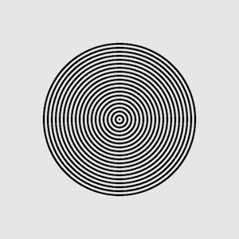

# Übungen 04

Bis nächste Woche, 28.10.2019, macht bitte folgende Aufgaben:

* Zeichnet weiter Daten über euch und euren auf. Ladet die Daten im Ordner [data/04](https://github.com/typografie-haw-hamburg/data/tree/master/04) hoch.
* **Moiré mit for-loop**

  * Versucht, mit einem for-Loop folgende Grafik zu erstellen:
  

  * Wenn ihr das geschafft habt, erstellt eine zweite solche Grafik, die aber dem Mauszeiger folgt (nutzt dazu die p5.js-Funktionen `mouseX` und `mouseY`). Wenn ihr diese zweite Grafik mit der ersten überlagert, solltet ihr einen Moiré-Effekt zu sehen bekommen:

  

  * Erstellt als letzten Schritt ein eigenes Moiré-Muster, das sich mit der Maus verschieben lässt. Das Muster kann zum Beispiel aus Linien, Rechtecken oder Zickzack-Linien bestehen. Benutzt wieder for-Loops, um viele dieser gleichen Formen nebeneinander zu setzen.

  * Macht einen Screenshot vom Ergebnis und ladet diesen in den [04/media Ordner](media) hoch.

