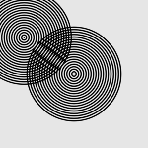

# Übungen 04

Bis nächste Woche, 28.10.2019, macht bitte folgende Aufgaben:

* Zeichnet weiter Daten über euch auf. Ladet die Daten im Ordner [data/04](https://github.com/typografie-haw-hamburg/data/tree/master/04) hoch.
* **Moiré mit for-loop**

  * Versucht, mit einem for-Loop folgende Grafik zu erstellen:

    

  * Dann erstellt eine zweite solche Grafik, die aber dem Mauszeiger folgt (nutzt dazu die p5.js-Funktionen `mouseX` und `mouseY`). Wenn ihr diese zweite Grafik mit der ersten überlagert, sollte ein Moiré-Muster entstehen:

    

  * **Erstellt als letzten Schritt ein eigenes Moiré-Muster**, das sich mit der Maus verschieben lässt. Das Muster kann z.B. aus Linien, Rechtecken oder Zickzack-Linien bestehen. Benutzt wieder for-Loops, um viele dieser gleichen Formen nebeneinander zu setzen. Experimentiert auch mit Farben, Strichstärken etc.

  * Macht einen Screenshot vom Ergebnis und ladet diesen in den [media Ordner](media) hoch. Dann bearbeitet euren Eintrag bei den [Resultaten](resultate04.md) so (oben auf den Stift klicken), dass euer Screenshot und euer Sketch im Editor verlinkt sind (für schon verlinkte Beispiele könnt ihr euch die [Resultate für Übung 03](../03/resultate03.md) anschauen).
