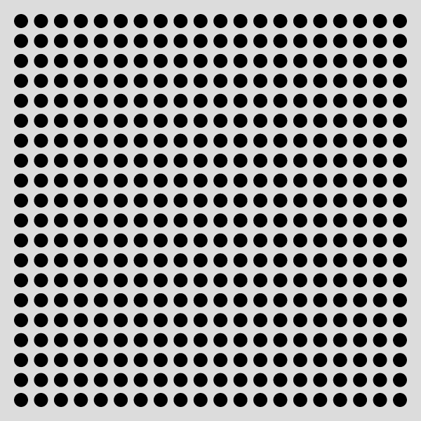
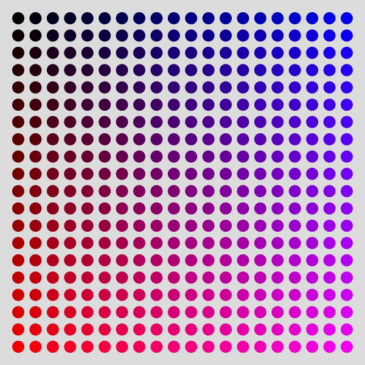
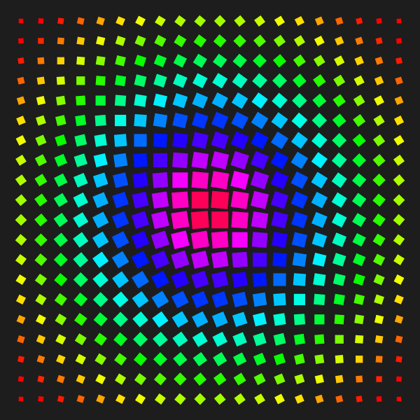

# Übungen 07

Bis Montag, 25.11.2019, macht bitte folgende Aufgaben:

* **CSV**

  * Erstellt bitte eine kleine Infografik, indem ihr eine CSV-Datei in euren Sketch ladet. Das kann entweder eine Datei sein, die ihr selbst aufgezeichnet habt, oder eine Datei mit Daten, die ihr woanders gefunden habt. Ihr könnt auch gerne eure Infografik von der vorherigen Infografik-Aufgabe so umbauen, dass sie jetzt mit einer CSV-Datei funktioniert (aber ihr lernt bestimmt mehr, wenn ihr eine neue Grafik mit neuen Daten anlegt).

  * Macht einen Screenshot vom Ergebnis und ladet diesen in den [media Ordner](media) hoch. Dann bearbeitet euren Eintrag bei den [Resultaten](resultate07.md) so (oben auf den Stift klicken), dass euer Screenshot und euer Sketch im Editor verlinkt sind.

  * Diese Aufgabe sollen bitte *alle* machen. Diejenigen, die beim vorletzten mal gefehlt haben, als das Laden von CSV-Dateien erklärt wurde, sollen sich bitte darüber informieren, wie das Laden von CSV-Dateien funktioniert, schließt euch notfalls mit anderen zusammen.

* **Raster**

  Diese Übung müsst ihr nicht hochladen, ich empfehle aber sie unbedingt trotzdem auszuprobieren, um `for-loops` und `map()` zu üben.

  * Versucht, mit Hilfe von for-loops folgende Grafik zu erstellen:

    

  * Wenn ihr das geschafft habt, versucht die Kreise so einzufärben, dass ein Verlauf entsteht, wie in folgender Grafik. Tipp: dazu braucht ihr den `map()`-Befehl.

    

  * [Optional] Falls das zu einfach war, könnt ihr das Raster weiter verändern, etwa indem ihr die Farben, Formen, Skalierung etc. ändert. Hier ein Beispiel:

    