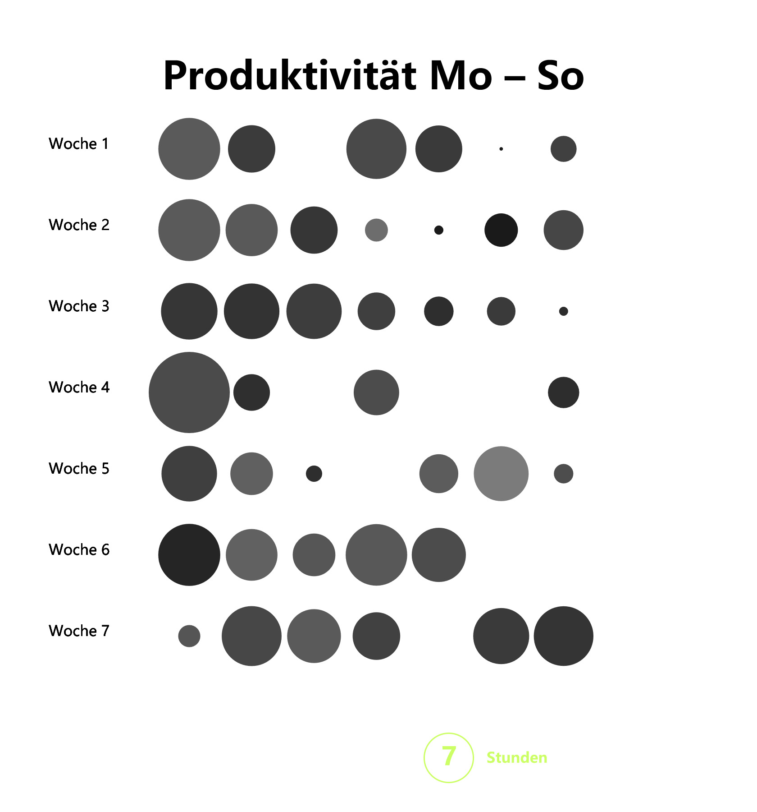
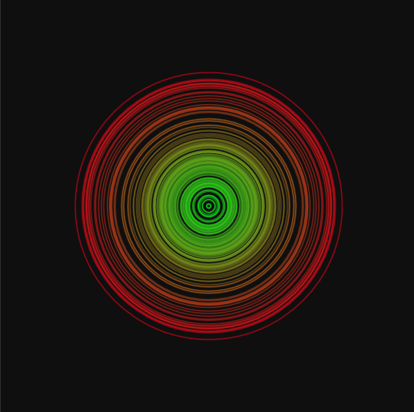
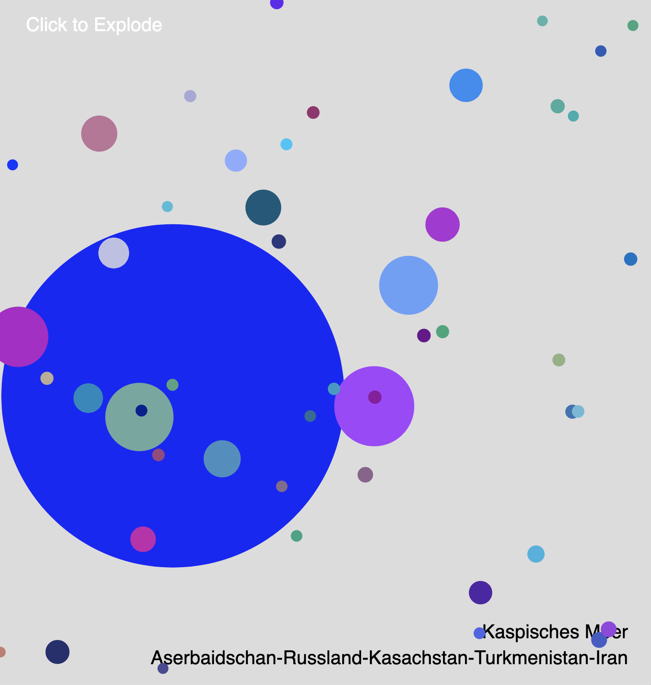
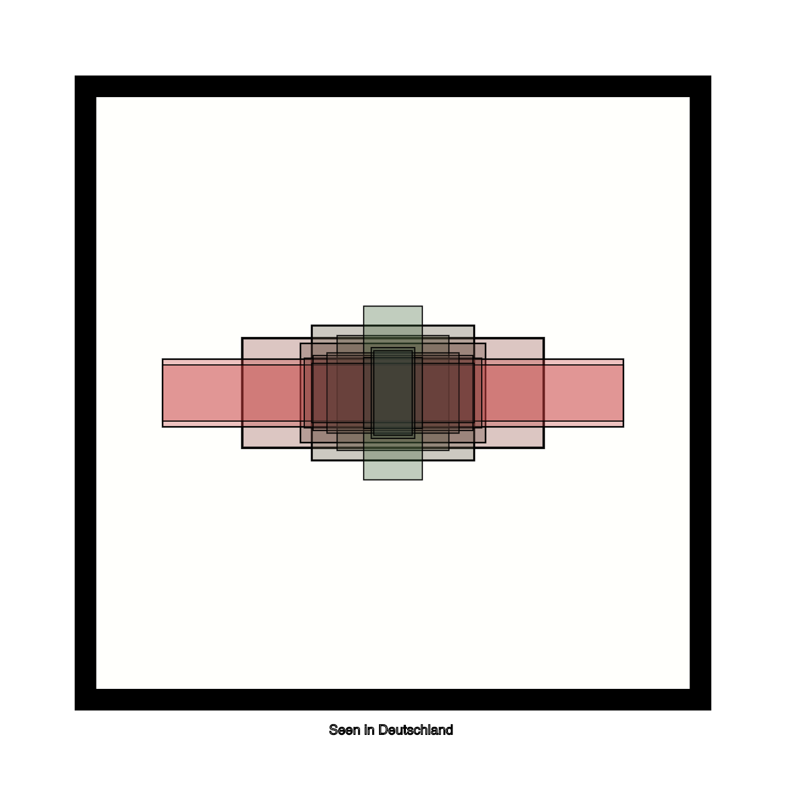
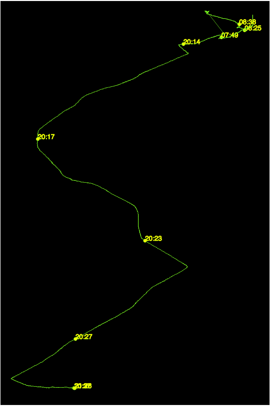
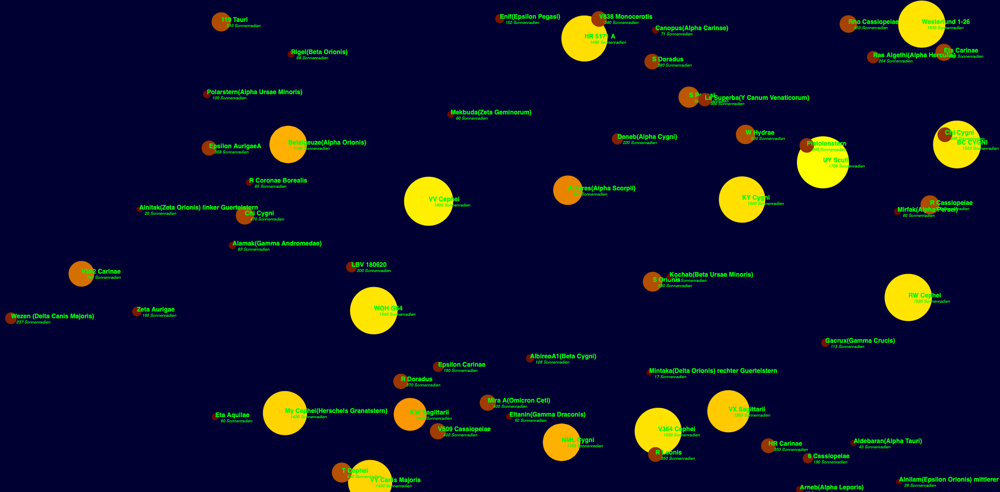
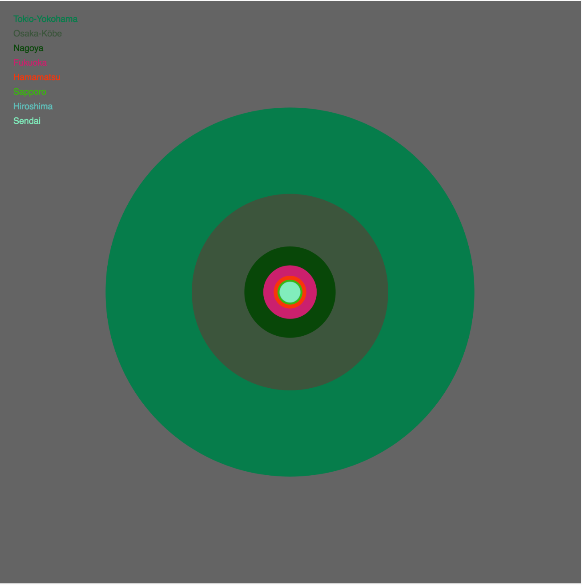

## Resultate 07

#### Annelen

🔗[Open in Editor](https://editor.p5js.org/Annelen/sketches/1YCDpdcb_)

---

#### Daniel

🔗[Open in Editor](https://editor.p5js.org/drmarzipan/sketches/OIG-LjCV0)

---

#### David

🔗[Open in Editor](https://editor.p5js.org/schnavy/full/748Zv9SnV)

---

#### Frederik

🔗[Open in Editor](https://editor.p5js.org/gribelgrubel/sketches/CXCihRjzX)

---

#### Frida

🔗[Open in Editor](https://editor.p5js.org/kahlofrida/sketches/Z-GUFvl-s)

---

#### Kaja

🔗[Open in Editor]()

---

#### Ha

🔗[Open in Editor]()

---

#### Heike

🔗[Open in Editor](https://editor.p5js.org/heikegrebin/sketches/dRik8ZK2k)

---

#### Laurenz

🔗[Open in Editor]()

---

#### Lis

🔗[Open in Editor]()

---

#### Mariia

🔗[Open in Editor]()

---

#### Martha

🔗[Open in Editor]()

---

#### Mert

🔗[Open in Editor](https://editor.p5js.org/mertekinci/present/6jvuzFLQm)

---

#### Nicola

🔗[Open in Editor](https://editor.p5js.org/nicola931/sketches/S9oy0cDqd)

---

#### Niklas

🔗[Open in Editor](https://editor.p5js.org/niklas92/sketches/nR05IeDyH)

---

#### Nina

🔗[Open in Editor]()

---

#### Rebecca

🔗[Open in Editor]()

---

#### Ricardo

🔗[Open in Editor]()

---

#### Sandy

🔗[Open in Editor]()

---

#### Sitong

🔗[Open in Editor]()

---

#### Undine

🔗[Open in Editor]()

---

#### Yudi

🔗[Open in Editor]()
